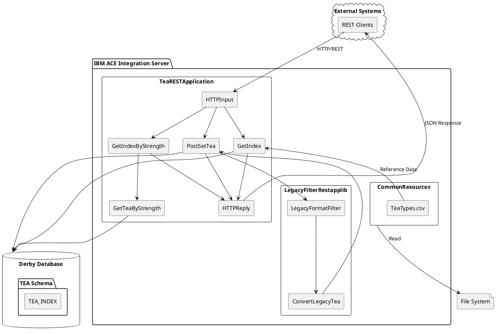
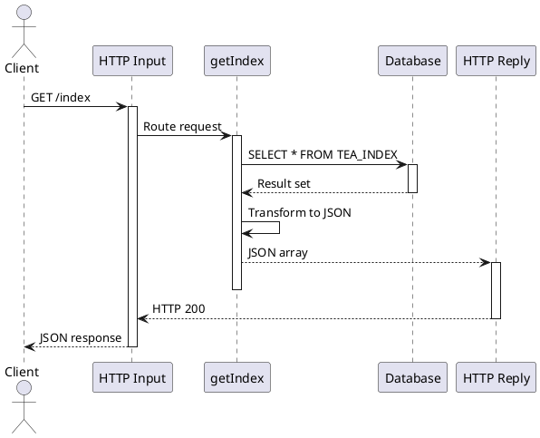
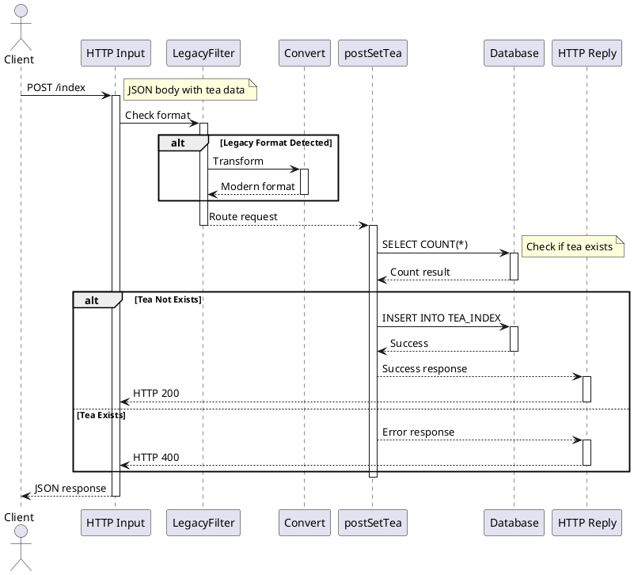

# 2. Project Overview and Architecture

## Business Problem

The **Tea Index REST API** solves the business problem of managing and accessing tea inventory data through a standardized REST interface. The application provides:

### Core Business Capabilities
1. **Tea Data Retrieval**
   - Query all teas in the index
   - Filter teas by strength level
   - Retrieve individual tea details

2. **Tea Data Management**
   - Add new tea entries to the index
   - Support for legacy data formats
   - Automatic format conversion

3. **Data Persistence**
   - Store tea data in relational database
   - Maintain tea type reference data
   - Support for concurrent access

### Business Value
- 📊 **Centralized Data**: Single source of truth for tea inventory
- 🔄 **Integration Ready**: RESTful API for easy integration
- 🔙 **Backward Compatibility**: Legacy format support for older systems
- 💾 **Data Persistence**: Reliable storage with database backing

## Technical Architecture

### Current IBM ACE Architecture



### Component Structure

#### 1. TeaRESTApplication
Main application containing all REST API flows.

**Flows:**
- `getIndex.subflow` - Retrieve all teas
- `getIndexByStrength.subflow` - Filter teas by strength parameter
- `getIndexByStrengthFromDB.subflow` - Database query for strength filter
- `getTeaByStrength.subflow` - Compute node with ESQL for DB query
- `postSetTea.subflow` - Create new tea entry
- `postSetTeaToDB.subflow` - Database insert operation
- `TeaRESTAPI.msgflow` - Main HTTP listener flow

**Configuration:**
- REST API definition in `swagger.json`
- JDBC connection configuration
- Server properties

#### 2. LegacyFilterRestapplib (Shared Library)
Handles legacy format detection and conversion.

**Components:**
- `LegacyFormatFilter.subflow` - Detects legacy format in requests
- `ConvertLegacyTea.esql` - Transforms legacy format to current format

**Purpose:**
- Backward compatibility with older client systems
- Format normalization before processing

#### 3. CommonResources (Shared Library)
Shared resources and reference data.

**Resources:**
- `TeaTypes.csv` - Reference data for tea types
- Shared schemas
- Common utilities

### Data Flow Diagrams

#### GET /index - Retrieve All Teas



#### POST /index - Create Tea Entry



## External Dependencies

### 1. Apache Derby Database
**Type:** Embedded Relational Database

**Description:**
- Lightweight Java-based database
- Embedded mode (runs in same JVM)
- JDBC connectivity

**Usage in Project:**
- Stores tea index data in `TEA_INDEX` table
- Schema: `TEA` 
- Tables: `TEA_INDEX` (NAME, STRENGTH, CAFFEINATED)

**Migration Considerations:**
- Consider PostgreSQL or MySQL for production
- Derby acceptable for development/testing
- JPA/Hibernate abstraction for easy database swap

### 2. File System
**Type:** Local File Storage

**Description:**
- Read-only access to reference data
- CSV file format

**Usage in Project:**
- `TeaTypes.csv` contains tea type reference data
- Loaded at startup or on-demand
- Used for validation and lookup

**Migration Considerations:**
- Move to database table for better management
- Or use Spring Boot resources
- Consider configuration management system

### 3. Jackson/JSON Libraries
**Type:** Data Serialization

**Description:**
- JSON parsing and generation
- Built-in to both ACE and Camel

**Usage in Project:**
- Request/response JSON serialization
- Data transformation

**Migration Considerations:**
- Apache Camel has built-in Jackson support
- Minimal changes needed

## Integration Protocols

### 1. HTTP/REST
**Type:** Synchronous Request-Response

**Description:**
- RESTful API following HTTP standards
- JSON content type
- Standard HTTP methods (GET, POST)

**Usage in Project:**

**Endpoints:**
```
GET  /index                    - Get all teas
GET  /index?strength={value}   - Get teas by strength
POST /index                    - Create new tea
```

**Request Headers:**
- `Content-Type: application/json`
- `Accept: application/json`

**Response Codes:**
- `200 OK` - Success
- `400 Bad Request` - Validation error
- `500 Internal Server Error` - Server error

**Migration to Camel:**
```java
rest("/index")
  .get()
    .to("direct:getIndex")
  .get("?strength={strength}")
    .to("direct:getIndexByStrength")
  .post()
    .type(Tea.class)
    .to("direct:postSetTea");
```

### 2. JDBC/Database
**Type:** Synchronous Database Access

**Description:**
- JDBC protocol for database connectivity
- SQL queries (SELECT, INSERT)
- Connection pooling

**Usage in Project:**
- Execute SQL via ESQL compute nodes
- JDBC compute node configuration
- Connection details in properties

**Current Implementation (ESQL):**
```sql
-- Query example from getTeaByStrength.esql
SELECT NAME, STRENGTH, CAFFEINATED 
FROM TEA_INDEX 
WHERE STRENGTH = ''' || InputLocalEnvironment.REST.Input.Parameters.strength || ''';
```

**Migration to Camel (JPA):**
```java
@Entity
@Table(name = "TEA_INDEX", schema = "TEA")
public class Tea {
    @Id
    @Column(name = "NAME")
    private String name;
    
    @Column(name = "STRENGTH")
    private String strength;
    
    @Column(name = "CAFFEINATED")
    private Boolean caffeinated;
}

// Repository
public interface TeaRepository extends JpaRepository<Tea, String> {
    List<Tea> findByStrength(String strength);
}
```

## Security Components

### Current State

⚠️ **WARNING: Limited Security Implementation**

The current IBM ACE application has minimal security controls:

#### 1. No Authentication
**Issue:** API endpoints are publicly accessible without authentication

**Risk:** 
- Unauthorized access to data
- Potential for abuse
- No audit trail

**Recommendation:** 
- Implement OAuth 2.0 / JWT authentication
- API key validation
- Rate limiting

#### 2. No Authorization
**Issue:** No role-based access control

**Risk:**
- All authenticated users have same privileges
- Cannot restrict operations by user role

**Recommendation:**
- Implement RBAC with Spring Security
- Define roles: READ_ONLY, WRITE, ADMIN

#### 3. SQL Injection Vulnerability
**Issue:** String concatenation for SQL queries

**Location:** `getTeaByStrength.esql`
```sql
-- VULNERABLE CODE
WHERE STRENGTH = ''' || InputLocalEnvironment.REST.Input.Parameters.strength || ''';
```

**Risk:** 
- Database compromise
- Data exfiltration
- Data modification

**Recommendation:**
- Use prepared statements
- Input validation and sanitization
- JPA/Hibernate parameterized queries

#### 4. Hardcoded Credentials
**Issue:** Database credentials in source code

**Risk:**
- Credential exposure in version control
- Cannot rotate credentials easily
- Compliance violations

**Recommendation:**
- Externalize to properties files
- Use environment variables
- Consider HashiCorp Vault or AWS Secrets Manager

### Recommended Security Architecture (Camel)

```java
// 1. Authentication with JWT
@Configuration
@EnableWebSecurity
public class SecurityConfig extends WebSecurityConfigurerAdapter {
    
    @Override
    protected void configure(HttpSecurity http) throws Exception {
        http
            .authorizeRequests()
                .antMatchers("/index").authenticated()
                .and()
            .oauth2ResourceServer()
                .jwt();
    }
}

// 2. SQL Injection Prevention with JPA
@Repository
public interface TeaRepository extends JpaRepository<Tea, String> {
    // Safe parameterized query
    @Query("SELECT t FROM Tea t WHERE t.strength = :strength")
    List<Tea> findByStrength(@Param("strength") String strength);
}

// 3. Input Validation
public class Tea {
    @NotBlank(message = "Name is required")
    @Size(max = 100)
    private String name;
    
    @Pattern(regexp = "^(weak|medium|strong)$")
    private String strength;
    
    @NotNull
    private Boolean caffeinated;
}

// 4. Externalized Configuration
# application.yml
spring:
  datasource:
    url: ${DB_URL}
    username: ${DB_USERNAME}
    password: ${DB_PASSWORD}
```

## Known Technical Debt

### 1. Legacy Format Support
**Description:** Application still supports outdated data format

**Impact:**
- Added complexity in code
- Maintenance burden
- Performance overhead

**Recommendation:**
- Deprecate legacy format
- Provide migration guide for clients
- Remove after grace period

### 2. File-based Reference Data
**Description:** Tea types loaded from CSV file

**Impact:**
- Not scalable
- No versioning
- Cannot update without redeployment

**Recommendation:**
- Move to database table
- Implement admin API for updates
- Version control for reference data

### 3. Embedded Database
**Description:** Derby embedded not suitable for production

**Impact:**
- Single point of failure
- No clustering/replication
- Limited performance
- No separate backup

**Recommendation:**
- Migrate to PostgreSQL or MySQL
- Implement database clustering
- Proper backup strategy

### 4. Race Condition in POST
**Description:** SELECT + INSERT without proper locking

**Code:**
```sql
-- Step 1: Check if exists
SET count = SELECT COUNT(*) FROM TEA_INDEX WHERE NAME = name;

-- Step 2: Insert if not exists (RACE CONDITION HERE)
IF count = 0 THEN
  INSERT INTO TEA_INDEX VALUES (...);
END IF;
```

**Impact:**
- Duplicate entries possible
- Data integrity issues

**Recommendation:**
- Use UNIQUE constraint on database
- Implement optimistic locking
- Or use INSERT ... ON CONFLICT in PostgreSQL

### 5. Limited Error Handling
**Description:** Generic error responses

**Impact:**
- Poor user experience
- Difficult debugging
- No error codes

**Recommendation:**
- Implement proper error handling
- Use standard error codes
- Provide meaningful error messages

```java
// Example error response structure
{
  "error": {
    "code": "TEA_ALREADY_EXISTS",
    "message": "A tea with this name already exists",
    "field": "name",
    "timestamp": "2025-01-15T10:30:00Z"
  }
}
```

### 6. No Monitoring/Observability
**Description:** Limited metrics and logging

**Impact:**
- Difficult to troubleshoot
- No performance insights
- Cannot detect issues proactively

**Recommendation:**
- Implement Spring Boot Actuator
- Add Prometheus metrics
- Structured logging with correlation IDs
- Distributed tracing with Jaeger/Zipkin

---

**Document Version**: 1.0  
**Last Updated**: 2025  
**Status**: Final