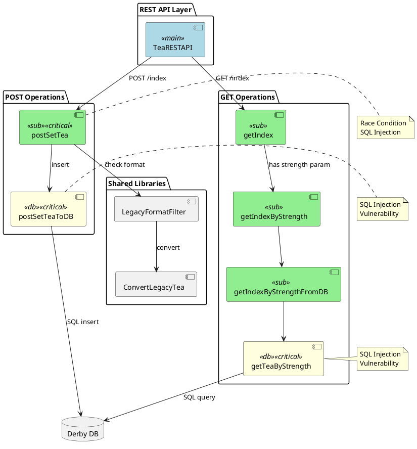

# 4. Flow Inventory

## Overview

This document catalogs all integration flows in the Tea Index REST API application, providing a comprehensive reference for the migration from IBM ACE to Apache Camel.

## Flow Summary

| # | Flow Name | Type | Entry Point | Exit Point | Complexity | Effort (days) |
|---|-----------|------|-------------|------------|------------|---------------|
| 1 | TeaRESTAPI | Main Flow | HTTP Input | HTTP Reply | Low | 0.5 |
| 2 | getIndex | Subflow | HTTP GET /index | Database | Low | 1.5 |
| 3 | getIndexByStrength | Subflow | HTTP GET /index?strength | Subflow call | Low | 0.5 |
| 4 | getIndexByStrengthFromDB | Subflow | Internal | Subflow call | Low | 0.5 |
| 5 | getTeaByStrength | Subflow | Internal | Database (ESQL) | Medium | 1.0 |
| 6 | postSetTea | Subflow | HTTP POST /index | Database | High | 4.0 |
| 7 | postSetTeaToDB | Subflow | Internal | Database (ESQL) | Medium | 0.5 |
| **TOTAL** | | | | | | **8.5 days** |

## Detailed Flow Inventory

### Flow 1: TeaRESTAPI
**Flow Name:** `TeaRESTAPI.msgflow`  
**Type:** Main HTTP Listener Flow  
**Entry Point:** HTTPInput node listening on REST endpoints  
**Exit Point:** HTTPReply node

**Description:**
Main entry point for all REST API requests. Routes incoming HTTP requests to appropriate subflows based on HTTP method and path.

**Systems Connected:**
- External REST clients (consumers)
- Internal subflows (getIndex, postSetTea)

**Subflows/Refs:**
- getIndex.subflow
- getIndexByStrength.subflow
- postSetTea.subflow

**Integration Patterns:**
- Request-Reply
- Content-Based Router

**Integration Protocols:**
- HTTP/REST

**Message Transformation:**
- None (routing only)

**Error Handling:**
- HTTP error codes
- Generic error responses

**External Dependencies:**
- None

**Security:**
- ⚠️ No authentication
- ⚠️ No authorization

**Known Technical Debt:**
- No input validation at entry point
- Generic error messages

**Migration Notes:**
- Migrate to Camel REST DSL
- Add authentication/authorization
- Implement proper error handling

---

### Flow 2: getIndex
**Flow Name:** `getIndex.subflow`  
**Type:** Database Query Flow  
**Entry Point:** Called from TeaRESTAPI (GET /index)  
**Exit Point:** Database SELECT query

**Description:**
Retrieves all tea entries from the database and returns them as JSON array. Handles both parameterized requests (with strength filter) and non-parameterized requests (all teas).

**Systems Connected:**
- Derby database (TEA schema)
- File system (TeaTypes.csv for reference data)

**Subflows/Refs:**
- getIndexByStrength.subflow (when strength parameter present)

**Integration Patterns:**
- Message Translator (DB to JSON)
- Content Enricher (adds tea types)

**Integration Protocols:**
- JDBC
- File I/O

**Message Transformation:**
- Database ResultSet to JSON array
- Field mapping: NAME, STRENGTH, CAFFEINATED

**Error Handling:**
- Database connection errors
- File read errors

**External Dependencies:**
- Derby database
- TeaTypes.csv file

**Security:**
- ⚠️ No SQL injection protection in subflows

**Known Technical Debt:**
- File-based reference data
- No caching
- No pagination

**Migration Effort:** 1.5 days

**Migration Notes:**
- Use JPA repository findAll()
- Move TeaTypes to database table
- Add pagination support
- Implement caching

---

### Flow 3: getIndexByStrength
**Flow Name:** `getIndexByStrength.subflow`  
**Type:** Router Flow  
**Entry Point:** Called from getIndex with strength parameter  
**Exit Point:** Calls getIndexByStrengthFromDB

**Description:**
Intermediate routing flow that extracts strength parameter and routes to database query subflow.

**Systems Connected:**
- None (routing only)

**Subflows/Refs:**
- getIndexByStrengthFromDB.subflow

**Integration Patterns:**
- Message Router

**Integration Protocols:**
- Internal (direct call)

**Message Transformation:**
- Parameter extraction

**Error Handling:**
- Parameter validation

**External Dependencies:**
- None

**Security:**
- ⚠️ No input validation

**Known Technical Debt:**
- Unnecessary intermediate flow
- Could be merged with getIndexByStrengthFromDB

**Migration Effort:** 0.5 days

**Migration Notes:**
- Can be eliminated in Camel (direct routing)
- Merge logic with getIndexByStrengthFromDB

---

### Flow 4: getIndexByStrengthFromDB
**Flow Name:** `getIndexByStrengthFromDB.subflow`  
**Type:** Router Flow  
**Entry Point:** Called from getIndexByStrength  
**Exit Point:** Calls getTeaByStrength

**Description:**
Another intermediate routing flow that prepares for database query.

**Systems Connected:**
- None (routing only)

**Subflows/Refs:**
- getTeaByStrength.subflow

**Integration Patterns:**
- Message Router

**Integration Protocols:**
- Internal (direct call)

**Message Transformation:**
- None

**Error Handling:**
- Passthrough

**External Dependencies:**
- None

**Security:**
- None

**Known Technical Debt:**
- Unnecessary intermediate flow
- Overly complex flow structure

**Migration Effort:** 0.5 days

**Migration Notes:**
- Eliminate in Camel migration
- Consolidate with getTeaByStrength

---

### Flow 5: getTeaByStrength
**Flow Name:** `getTeaByStrength.subflow`  
**Type:** Database Query with ESQL  
**Entry Point:** Called from getIndexByStrengthFromDB  
**Exit Point:** Database SELECT with WHERE clause

**Description:**
Executes parameterized database query to retrieve teas filtered by strength value using ESQL compute node.

**Systems Connected:**
- Derby database (TEA schema, TEA_INDEX table)

**Subflows/Refs:**
- None

**Integration Patterns:**
- Message Filter
- Message Translator

**Integration Protocols:**
- JDBC

**Message Transformation:**
- ESQL query execution
- ResultSet to JSON

**ESQL Code:**
```sql
CREATE COMPUTE MODULE getTeaByStrength
    CREATE FUNCTION Main() RETURNS BOOLEAN
    BEGIN
        DECLARE strength CHARACTER;
        SET strength = InputLocalEnvironment.REST.Input.Parameters.strength;
        
        -- VULNERABILITY: SQL Injection via string concatenation
        SET OutputRoot.JSON.Data.teas = 
            (SELECT NAME, STRENGTH, CAFFEINATED 
             FROM Database.TEA_INDEX 
             WHERE STRENGTH = ''' || strength || ''');
        
        RETURN TRUE;
    END;
END MODULE;
```

**Error Handling:**
- Database errors
- Empty result set

**External Dependencies:**
- Derby database

**Security:**
- ❌ **CRITICAL: SQL Injection Vulnerability**
- String concatenation for SQL query
- No input sanitization

**Known Technical Debt:**
- SQL injection vulnerability
- No prepared statements
- ESQL instead of modern ORM

**Migration Effort:** 1.0 day

**Migration Notes:**
- **MUST FIX SQL injection**
- Use JPA with parameterized queries
- Implement input validation

**Camel Migration Example:**
```java
// Repository with safe parameterized query
@Repository
public interface TeaRepository extends JpaRepository<Tea, String> {
    @Query("SELECT t FROM Tea t WHERE t.strength = :strength")
    List<Tea> findByStrength(@Param("strength") String strength);
}

// Route
from("direct:getTeaByStrength")
    .validate(header("strength").isNotNull())
    .bean(teaRepository, "findByStrength(${header.strength})")
    .marshal().json();
```

---

### Flow 6: postSetTea
**Flow Name:** `postSetTea.subflow`  
**Type:** Complex POST Handler with Legacy Support  
**Entry Point:** Called from TeaRESTAPI (POST /index)  
**Exit Point:** Database INSERT operation

**Description:**
Most complex flow handling tea creation with legacy format detection, conversion, existence check, and database insertion. Contains multiple vulnerabilities.

**Systems Connected:**
- Derby database (TEA schema, TEA_INDEX table)
- LegacyFilterRestapplib (shared library)

**Subflows/Refs:**
- LegacyFormatFilter.subflow (from shared library)
- ConvertLegacyTea.esql (from shared library)
- postSetTeaToDB.subflow

**Integration Patterns:**
- Content-Based Router (legacy format detection)
- Message Translator (legacy conversion)
- Message Validator (existence check)

**Integration Protocols:**
- HTTP/REST
- JDBC

**Message Transformation:**
1. Legacy format detection
2. Format conversion if needed
3. JSON parsing
4. Database mapping

**Flow Logic:**
```
1. Receive POST request
2. Check for legacy format marker
3. IF legacy format:
   - Convert to modern format
4. Extract tea data (name, strength, caffeinated)
5. Check if tea exists in database
6. IF exists:
   - Return error
7. ELSE:
   - Insert into database
   - Return success
```

**Error Handling:**
- Duplicate tea error
- Database errors
- Validation errors

**External Dependencies:**
- Derby database
- LegacyFilterRestapplib library

**Security:**
- ❌ **CRITICAL: SQL Injection in existence check**
- ❌ **HIGH: Race condition between SELECT and INSERT**
- ⚠️ No input validation

**Known Technical Debt:**
1. **SQL Injection:** String concatenation in queries
2. **Race Condition:** Non-atomic SELECT + INSERT
3. **Legacy Format:** Outdated format still supported
4. **Complex Logic:** Too many responsibilities
5. **No Transaction:** No rollback capability

**Migration Effort:** 4.0 days (includes security fixes)

**Migration Notes:**
- **CRITICAL: Fix SQL injection**
- **CRITICAL: Fix race condition**
- Use database UNIQUE constraint
- Implement proper validation
- Consider deprecating legacy format

**Camel Migration Example:**
```java
// Entity with unique constraint
@Entity
@Table(name = "TEA_INDEX", 
       uniqueConstraints = @UniqueConstraint(columnNames = "NAME"))
public class Tea {
    @Id
    private String name;
    private String strength;
    private Boolean caffeinated;
}

// Service with transaction
@Service
public class TeaService {
    @Autowired
    private TeaRepository repository;
    
    @Transactional
    public Tea createTea(Tea tea) {
        // Database constraint prevents duplicates
        return repository.save(tea);
    }
}

// Route with legacy support
from("direct:postTea")
    // Legacy format detection
    .choice()
        .when(jsonpath("$.format", "legacy"))
            .bean(legacyConverter, "convertToModern")
    .end()
    
    // Validation
    .process(teaValidator)
    
    // Create tea
    .doTry()
        .bean(teaService, "createTea")
        .setHeader(Exchange.HTTP_RESPONSE_CODE, constant(201))
        .setBody(simple("{\"status\": \"success\"}"))
    .doCatch(DataIntegrityViolationException.class)
        .handled(true)
        .setHeader(Exchange.HTTP_RESPONSE_CODE, constant(400))
        .setBody(simple("{\"error\": \"Tea already exists\"}"))
    .end();
```

---

### Flow 7: postSetTeaToDB
**Flow Name:** `postSetTeaToDB.subflow`  
**Type:** Database INSERT with ESQL  
**Entry Point:** Called from postSetTea  
**Exit Point:** Database INSERT operation

**Description:**
Executes database INSERT operation using ESQL compute node. Contains SQL injection vulnerability.

**Systems Connected:**
- Derby database (TEA schema, TEA_INDEX table)

**Subflows/Refs:**
- None

**Integration Patterns:**
- Message Translator

**Integration Protocols:**
- JDBC

**Message Transformation:**
- JSON to SQL INSERT

**ESQL Code:**
```sql
CREATE COMPUTE MODULE postSetTeaToDB
    CREATE FUNCTION Main() RETURNS BOOLEAN
    BEGIN
        DECLARE name CHARACTER InputRoot.JSON.Data.name;
        DECLARE strength CHARACTER InputRoot.JSON.Data.strength;
        DECLARE caffeinated BOOLEAN InputRoot.JSON.Data.caffeinated;
        
        -- VULNERABILITY: SQL Injection
        INSERT INTO Database.TEA_INDEX (NAME, STRENGTH, CAFFEINATED)
        VALUES (''' || name || ''', 
                ''' || strength || ''', 
                ''' || caffeinated || ''');
        
        RETURN TRUE;
    END;
END MODULE;
```

**Error Handling:**
- Database errors
- Constraint violations

**External Dependencies:**
- Derby database

**Security:**
- ❌ **CRITICAL: SQL Injection Vulnerability**

**Known Technical Debt:**
- SQL injection
- No prepared statements
- Direct ESQL instead of ORM

**Migration Effort:** 0.5 days

**Migration Notes:**
- Replace with JPA repository save()
- Use entity validation

---

## Flow Dependencies



## Migration Priority

### High Priority (Security Issues)
1. **postSetTea** - Race condition + SQL injection
2. **postSetTeaToDB** - SQL injection
3. **getTeaByStrength** - SQL injection

### Medium Priority (Core Functionality)
4. **getIndex** - Main query flow
5. **TeaRESTAPI** - Entry point

### Low Priority (Can be eliminated)
6. **getIndexByStrength** - Routing only
7. **getIndexByStrengthFromDB** - Routing only

## Summary Statistics

- **Total Flows:** 7
- **Main Flows:** 1
- **Subflows:** 6
- **Database Operations:** 3
- **Critical Security Issues:** 3
- **Estimated Migration Effort:** 8.5 days
- **Lines of ESQL:** ~200
- **External Dependencies:** 2 (Database, File System)

---

**Document Version**: 1.0  
**Last Updated**: 2025  
**Status**: Final