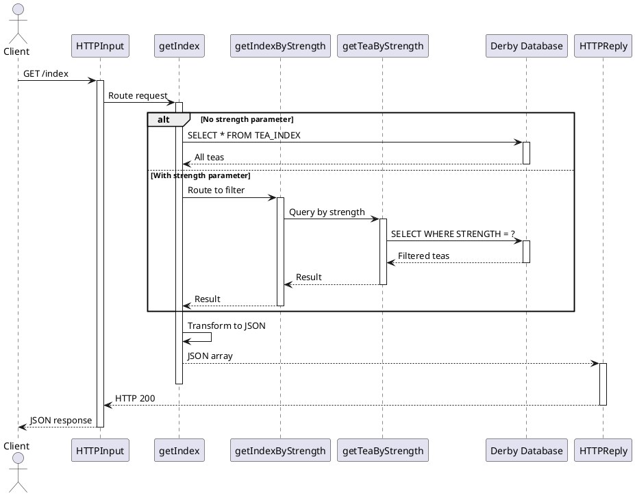

# 5. Flow Details - GET Operations

## Flow: GET /index - Retrieve All Teas

### Overview

**Flow Name:** `getIndex.subflow`  
**HTTP Method:** GET  
**Endpoint:** `/index`  
**Query Parameters:** `strength` (optional)

### Description

The GET /index flow retrieves tea data from the database and returns it as a JSON array. It supports both retrieving all teas and filtering by strength parameter.

**Flow Logic:**
1. Receive HTTP GET request on `/index`
2. Check if `strength` query parameter exists
3. If no parameter: Query all teas from database
4. If parameter exists: Route to strength-filtered query
5. Transform database result to JSON
6. Return HTTP 200 with JSON array

### Flow Diagram



### Component Breakdown

#### IBM ACE Components

1. **HTTPInput Node**
   - Listens on REST endpoint
   - Path: `/index`
   - Method: GET

2. **getIndex.subflow**
   - Checks for query parameters
   - Executes database query
   - Transforms to JSON

3. **getIndexByStrength.subflow** (when strength parameter present)
   - Extracts strength parameter
   - Routes to database query

4. **getIndexByStrengthFromDB.subflow**
   - Intermediate routing
   - Calls compute node

5. **getTeaByStrength.subflow**
   - ESQL compute node
   - Executes SQL query
   - ⚠️ Contains SQL injection vulnerability

### API Specification

**Request:**
```http
GET /index HTTP/1.1
Host: localhost:7800
Accept: application/json

OR

GET /index?strength=medium HTTP/1.1
Host: localhost:7800
Accept: application/json
```

**Response (200 OK):**
```json
[
  {
    "name": "Earl Grey",
    "strength": "medium",
    "caffeinated": true
  },
  {
    "name": "Chamomile",
    "strength": "weak",
    "caffeinated": false
  },
  {
    "name": "English Breakfast",
    "strength": "strong",
    "caffeinated": true
  }
]
```

**Response (filtered by strength=medium):**
```json
[
  {
    "name": "Earl Grey",
    "strength": "medium",
    "caffeinated": true
  }
]
```

### Enterprise Integration Patterns

| Pattern | IBM ACE Implementation | Apache Camel Equivalent |
|---------|------------------------|-------------------------|
| **Request-Reply** | HTTPInput + HTTPReply | REST DSL with automatic reply |
| **Content-Based Router** | Filter node on parameter | `choice().when(header("strength"))` |
| **Message Translator** | ESQL ResultSet to JSON | `marshal().json()` |
| **Message Filter** | WHERE clause in SQL | JPA query method |

### Apache Camel Migration

#### 1. REST Endpoint Definition

```java
@Component
public class TeaRoutes extends RouteBuilder {
    
    @Override
    public void configure() throws Exception {
        
        // REST API configuration
        restConfiguration()
            .component("servlet")
            .bindingMode(RestBindingMode.json)
            .dataFormatProperty("prettyPrint", "true")
            .apiContextPath("/api-doc")
            .apiProperty("api.title", "Tea Index API")
            .apiProperty("api.version", "1.0");
        
        // REST endpoint
        rest("/index")
            .description("Tea Index Operations")
            
            .get()
                .description("Get all teas or filter by strength")
                .param()
                    .name("strength")
                    .type(RestParamType.query)
                    .description("Filter by tea strength (weak, medium, strong)")
                    .required(false)
                .endParam()
                .outType(Tea[].class)
                .responseMessage()
                    .code(200)
                    .message("Success")
                .endResponseMessage()
                .to("direct:getIndex");
    }
}
```

#### 2. Route Implementation

```java
// Main route
from("direct:getIndex")
    .routeId("getTeaIndex")
    .log("Received request to get tea index")
    
    // Content-based routing on strength parameter
    .choice()
        .when(header("strength").isNotNull())
            .log("Filtering by strength: ${header.strength}")
            .to("direct:getTeaByStrength")
        .otherwise()
            .log("Getting all teas")
            .to("direct:getAllTeas")
    .end();

// Get all teas
from("direct:getAllTeas")
    .routeId("getAllTeas")
    .bean(teaRepository, "findAll")
    .log("Retrieved ${body.size()} teas from database");

// Get teas by strength
from("direct:getTeaByStrength")
    .routeId("getTeaByStrength")
    
    // Validate strength parameter
    .process(exchange -> {
        String strength = exchange.getIn().getHeader("strength", String.class);
        if (!Arrays.asList("weak", "medium", "strong").contains(strength)) {
            throw new ValidationException("Invalid strength value: " + strength);
        }
    })
    
    // Query database with safe parameterized query
    .bean(teaRepository, "findByStrength(${header.strength})")
    .log("Retrieved ${body.size()} teas with strength ${header.strength}");
```

#### 3. JPA Entity

```java
@Entity
@Table(name = "TEA_INDEX", schema = "TEA")
public class Tea {
    
    @Id
    @Column(name = "NAME", length = 100)
    private String name;
    
    @Column(name = "STRENGTH", length = 20)
    private String strength;
    
    @Column(name = "CAFFEINATED")
    private Boolean caffeinated;
    
    // Constructors, getters, setters, equals, hashCode
    
    public Tea() {}
    
    public Tea(String name, String strength, Boolean caffeinated) {
        this.name = name;
        this.strength = strength;
        this.caffeinated = caffeinated;
    }
    
    // Getters and setters...
}
```

#### 4. Repository with Safe Queries

```java
@Repository
public interface TeaRepository extends JpaRepository<Tea, String> {
    
    /**
     * Find teas by strength using safe parameterized query.
     * FIXES SQL injection vulnerability from ACE implementation.
     */
    @Query("SELECT t FROM Tea t WHERE t.strength = :strength")
    List<Tea> findByStrength(@Param("strength") String strength);
    
    // Alternative: Spring Data method naming
    // List<Tea> findByStrength(String strength);
}
```

### Testing Strategy

#### Unit Tests

```java
@SpringBootTest
@CamelSpringBootTest
public class GetTeaRouteTest {
    
    @Autowired
    private ProducerTemplate template;
    
    @Autowired
    private TeaRepository repository;
    
    @BeforeEach
    public void setup() {
        repository.deleteAll();
        repository.save(new Tea("Earl Grey", "medium", true));
        repository.save(new Tea("Chamomile", "weak", false));
        repository.save(new Tea("English Breakfast", "strong", true));
    }
    
    @Test
    public void testGetAllTeas() {
        List<Tea> result = template.requestBody(
            "direct:getIndex", null, List.class);
        
        assertNotNull(result);
        assertEquals(3, result.size());
    }
    
    @Test
    public void testGetTeaByStrength() {
        Map<String, Object> headers = new HashMap<>();
        headers.put("strength", "medium");
        
        List<Tea> result = template.requestBodyAndHeaders(
            "direct:getIndex", null, headers, List.class);
        
        assertNotNull(result);
        assertEquals(1, result.size());
        assertEquals("Earl Grey", result.get(0).getName());
    }
    
    @Test
    public void testInvalidStrength() {
        Map<String, Object> headers = new HashMap<>();
        headers.put("strength", "invalid");
        
        assertThrows(ValidationException.class, () -> {
            template.requestBodyAndHeaders(
                "direct:getIndex", null, headers, List.class);
        });
    }
}
```

#### Integration Tests

```java
@SpringBootTest(webEnvironment = WebEnvironment.RANDOM_PORT)
public class TeaApiIntegrationTest {
    
    @LocalServerPort
    private int port;
    
    @Autowired
    private TeaRepository repository;
    
    @BeforeEach
    public void setup() {
        repository.deleteAll();
        repository.save(new Tea("Earl Grey", "medium", true));
        repository.save(new Tea("Chamomile", "weak", false));
    }
    
    @Test
    public void testGetAllTeasEndpoint() {
        given()
            .port(port)
        .when()
            .get("/index")
        .then()
            .statusCode(200)
            .contentType(ContentType.JSON)
            .body("size()", equalTo(2))
            .body("[0].name", notNullValue())
            .body("[0].strength", notNullValue())
            .body("[0].caffeinated", notNullValue());
    }
    
    @Test
    public void testGetTeaByStrengthEndpoint() {
        given()
            .port(port)
            .queryParam("strength", "medium")
        .when()
            .get("/index")
        .then()
            .statusCode(200)
            .contentType(ContentType.JSON)
            .body("size()", equalTo(1))
            .body("[0].name", equalTo("Earl Grey"))
            .body("[0].strength", equalTo("medium"));
    }
    
    @Test
    public void testInvalidStrengthParameter() {
        given()
            .port(port)
            .queryParam("strength", "invalid")
        .when()
            .get("/index")
        .then()
            .statusCode(400);
    }
}
```

### Migration Improvements

1. **Security Fix: SQL Injection Prevention**
   - ✅ Replaced string concatenation with JPA parameterized queries
   - ✅ Added input validation
   - ✅ Type-safe repository methods

2. **Performance Improvements**
   - Add database indexing on STRENGTH column
   - Implement caching with Spring Cache
   - Add pagination for large result sets

3. **Additional Features**
   - Input validation with enum for strength values
   - Pagination support (page, size parameters)
   - Sorting support
   - OpenAPI/Swagger documentation

### Migration Effort

**Estimated Time:** 3.5 days

**Breakdown:**
- REST endpoint setup: 0.5 day
- Route implementation: 1 day
- JPA entity and repository: 0.5 day
- Input validation: 0.5 day
- Unit tests: 0.5 day
- Integration tests: 0.5 day

---

**Document Version**: 1.0  
**Last Updated**: 2025  
**Status**: Final