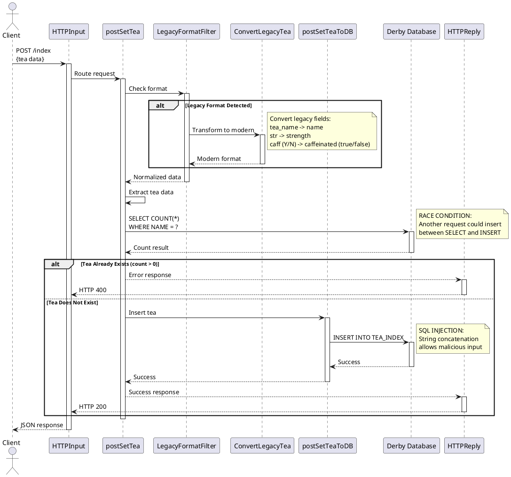

# 6. Flow Details - POST Operations

## Flow: POST /index - Create Tea Entry

### Overview

**Flow Name:** `postSetTea.subflow`  
**HTTP Method:** POST  
**Endpoint:** `/index`  
**Content-Type:** `application/json`

### Description

The POST /index flow creates a new tea entry in the database. It includes legacy format detection and conversion, duplicate checking, and database insertion. **This flow contains critical security vulnerabilities that must be fixed during migration.**

**Flow Logic:**
1. Receive HTTP POST request with JSON body
2. Detect if request uses legacy format
3. If legacy: Convert to modern format
4. Extract tea data (name, strength, caffeinated)
5. Query database to check if tea already exists
6. If exists: Return 400 error
7. If not exists: Insert into database
8. Return 200 success response

### Flow Diagram



### Component Breakdown

#### IBM ACE Components

1. **HTTPInput Node**
   - Listens on REST endpoint
   - Path: `/index`
   - Method: POST
   - Content-Type: application/json

2. **postSetTea.subflow**
   - Main orchestration flow
   - Coordinates legacy handling and database operations

3. **LegacyFormatFilter.subflow** (from LegacyFilterRestapplib)
   - Detects legacy format marker
   - Routes to conversion if needed

4. **ConvertLegacyTea.esql** (from LegacyFilterRestapplib)
   - Transforms legacy format to modern format
   - Field mappings:
     - `tea_name` → `name`
     - `str` → `strength`
     - `caff` ("Y"/"N") → `caffeinated` (true/false)

5. **postSetTeaToDB.subflow**
   - ESQL compute node
   - Executes INSERT statement
   - ❌ Contains SQL injection vulnerability

### API Specification

#### Modern Format Request

```http
POST /index HTTP/1.1
Host: localhost:7800
Content-Type: application/json

{
  "name": "Green Tea",
  "strength": "medium",
  "caffeinated": true
}
```

#### Legacy Format Request

```http
POST /index HTTP/1.1
Host: localhost:7800
Content-Type: application/json

{
  "format": "legacy",
  "tea_name": "Green Tea",
  "str": "medium",
  "caff": "Y"
}
```

#### Success Response (201 Created)

```json
{
  "status": "success",
  "message": "Tea created successfully",
  "tea": {
    "name": "Green Tea",
    "strength": "medium",
    "caffeinated": true
  }
}
```

#### Error Response (400 Bad Request - Duplicate)

```json
{
  "error": "Tea already exists",
  "code": "DUPLICATE_TEA",
  "message": "A tea with the name 'Green Tea' already exists in the index"
}
```

#### Error Response (400 Bad Request - Validation)

```json
{
  "error": "Validation failed",
  "code": "INVALID_INPUT",
  "message": "Strength must be one of: weak, medium, strong",
  "field": "strength"
}
```

### Critical Security Issues

#### Issue 1: SQL Injection Vulnerability (CRITICAL)

**Location:** `postSetTeaToDB.esql`

**Vulnerable Code:**
```sql
CREATE COMPUTE MODULE postSetTeaToDB
    CREATE FUNCTION Main() RETURNS BOOLEAN
    BEGIN
        DECLARE name CHARACTER InputRoot.JSON.Data.name;
        DECLARE strength CHARACTER InputRoot.JSON.Data.strength;
        DECLARE caffeinated CHARACTER InputRoot.JSON.Data.caffeinated;
        
        -- CRITICAL VULNERABILITY: String concatenation allows SQL injection
        INSERT INTO Database.TEA_INDEX (NAME, STRENGTH, CAFFEINATED)
        VALUES (''' || name || ''', 
                ''' || strength || ''', 
                ''' || caffeinated || ''');
        
        RETURN TRUE;
    END;
END MODULE;
```

**Attack Example:**
```json
{
  "name": "'; DROP TABLE TEA_INDEX; --",
  "strength": "medium",
  "caffeinated": true
}
```

**Impact:**
- Database compromise
- Data deletion
- Data exfiltration
- Unauthorized access

#### Issue 2: Race Condition (HIGH)

**Problem:** Non-atomic SELECT + INSERT operation

```sql
-- Step 1: Check if exists
SELECT COUNT(*) FROM TEA_INDEX WHERE NAME = 'Green Tea';
-- Result: 0 (doesn't exist)

-- Step 2: Insert (RACE CONDITION - another request could insert here)
INSERT INTO TEA_INDEX VALUES ('Green Tea', 'medium', true);
```

**Scenario:**
1. Request A checks if "Green Tea" exists → Not found
2. Request B checks if "Green Tea" exists → Not found (simultaneous)
3. Request A inserts "Green Tea" → Success
4. Request B inserts "Green Tea" → Duplicate entry!

**Impact:**
- Duplicate entries in database
- Data integrity violations
- Inconsistent state

#### Issue 3: Hardcoded Database Credentials

**Problem:** Database connection details in source code/properties

**Impact:**
- Credential exposure in version control
- Cannot rotate credentials easily
- Security compliance violations

### Enterprise Integration Patterns

| Pattern | IBM ACE Implementation | Apache Camel Equivalent |
|---------|------------------------|-------------------------|
| **Request-Reply** | HTTPInput + HTTPReply | REST DSL automatic |
| **Content-Based Router** | LegacyFormatFilter | `choice().when(jsonpath())` |
| **Message Translator** | ConvertLegacyTea ESQL | `process()` or `bean()` |
| **Message Validator** | Duplicate check | Bean validation + repository |
| **Idempotent Consumer** | Manual SELECT + INSERT | JPA unique constraint |

### Apache Camel Migration

#### 1. Entity with Unique Constraint

```java
@Entity
@Table(name = "TEA_INDEX", 
       schema = "TEA",
       uniqueConstraints = {
           @UniqueConstraint(columnNames = "NAME")
       })
public class Tea {
    
    @Id
    @Column(name = "NAME", length = 100, nullable = false)
    @NotBlank(message = "Tea name is required")
    @Size(max = 100, message = "Name must not exceed 100 characters")
    private String name;
    
    @Column(name = "STRENGTH", length = 20, nullable = false)
    @NotBlank(message = "Strength is required")
    @Pattern(regexp = "^(weak|medium|strong)$", 
             message = "Strength must be weak, medium, or strong")
    private String strength;
    
    @Column(name = "CAFFEINATED", nullable = false)
    @NotNull(message = "Caffeinated flag is required")
    private Boolean caffeinated;
    
    // Constructors, getters, setters, equals, hashCode
}
```

#### 2. Repository with Safe Operations

```java
@Repository
public interface TeaRepository extends JpaRepository<Tea, String> {
    
    /**
     * Check if tea exists by name.
     * Used for custom error messages.
     */
    boolean existsByName(String name);
    
    /**
     * Find tea by name.
     */
    Optional<Tea> findByName(String name);
}
```

#### 3. Service Layer with Transaction

```java
@Service
public class TeaService {
    
    @Autowired
    private TeaRepository repository;
    
    /**
     * Create new tea with proper error handling.
     * FIXES: SQL injection, race condition.
     */
    @Transactional
    public Tea createTea(Tea tea) {
        // Check for duplicate (optional - for better error message)
        if (repository.existsByName(tea.getName())) {
            throw new DuplicateTeaException(
                "A tea with the name '" + tea.getName() + "' already exists");
        }
        
        try {
            // Database unique constraint prevents race condition
            return repository.save(tea);
        } catch (DataIntegrityViolationException e) {
            // Handle race condition where tea was created between check and save
            throw new DuplicateTeaException(
                "A tea with this name was just created", e);
        }
    }
}

/**
 * Custom exception for duplicate tea.
 */
public class DuplicateTeaException extends RuntimeException {
    public DuplicateTeaException(String message) {
        super(message);
    }
    
    public DuplicateTeaException(String message, Throwable cause) {
        super(message, cause);
    }
}
```

#### 4. Legacy Format Converter

```java
@Component
public class LegacyTeaConverter {
    
    /**
     * Convert legacy tea format to modern format.
     * Replaces ConvertLegacyTea.esql
     */
    public Tea convertLegacyToModern(Map<String, Object> legacyTea) {
        Tea tea = new Tea();
        
        // Map legacy fields to modern fields
        tea.setName((String) legacyTea.get("tea_name"));
        tea.setStrength((String) legacyTea.get("str"));
        
        // Convert Y/N to boolean
        String caff = (String) legacyTea.get("caff");
        tea.setCaffeinated("Y".equalsIgnoreCase(caff));
        
        return tea;
    }
    
    /**
     * Check if request is in legacy format.
     */
    public boolean isLegacyFormat(Map<String, Object> request) {
        return "legacy".equals(request.get("format")) ||
               request.containsKey("tea_name");
    }
}
```

#### 5. Camel Route with Security Fixes

```java
@Component
public class TeaRoutes extends RouteBuilder {
    
    @Override
    public void configure() throws Exception {
        
        // Exception handling for duplicate tea
        onException(DuplicateTeaException.class)
            .handled(true)
            .setHeader(Exchange.HTTP_RESPONSE_CODE, constant(400))
            .setBody(simple(
                "{\"error\": \"${exception.message}\", " +
                "\"code\": \"DUPLICATE_TEA\"}")
            )
            .marshal().json();
        
        // Exception handling for validation errors
        onException(ConstraintViolationException.class)
            .handled(true)
            .setHeader(Exchange.HTTP_RESPONSE_CODE, constant(400))
            .process(exchange -> {
                ConstraintViolationException ex = 
                    exchange.getProperty(Exchange.EXCEPTION_CAUGHT, 
                                        ConstraintViolationException.class);
                
                String message = ex.getConstraintViolations()
                    .stream()
                    .map(ConstraintViolation::getMessage)
                    .collect(Collectors.joining(", "));
                
                Map<String, Object> error = new HashMap<>();
                error.put("error", "Validation failed");
                error.put("code", "INVALID_INPUT");
                error.put("message", message);
                
                exchange.getIn().setBody(error);
            })
            .marshal().json();
        
        // REST endpoint
        rest("/index")
            .post()
                .description("Create new tea entry")
                .type(Object.class)  // Accept generic object for legacy support
                .outType(Tea.class)
                .responseMessage()
                    .code(201).message("Tea created successfully")
                .endResponseMessage()
                .responseMessage()
                    .code(400).message("Duplicate tea or validation error")
                .endResponseMessage()
                .to("direct:postTea");
        
        // Main POST route with legacy support
        from("direct:postTea")
            .routeId("createTea")
            .log("Received POST request to create tea")
            
            // Legacy format detection and conversion
            .choice()
                .when(method(legacyTeaConverter, "isLegacyFormat"))
                    .log("Legacy format detected, converting...")
                    .bean(legacyTeaConverter, "convertLegacyToModern")
                .otherwise()
                    .log("Modern format detected")
                    .unmarshal().json(JsonLibrary.Jackson, Tea.class)
            .end()
            
            // Validation (automatic via Bean Validation annotations)
            .process(exchange -> {
                Tea tea = exchange.getIn().getBody(Tea.class);
                ValidatorFactory factory = Validation.buildDefaultValidatorFactory();
                Validator validator = factory.getValidator();
                Set<ConstraintViolation<Tea>> violations = validator.validate(tea);
                
                if (!violations.isEmpty()) {
                    throw new ConstraintViolationException(violations);
                }
            })
            
            // Create tea (with transaction and unique constraint)
            .bean(teaService, "createTea")
            .log("Successfully created tea: ${body.name}")
            
            // Success response
            .setHeader(Exchange.HTTP_RESPONSE_CODE, constant(201))
            .process(exchange -> {
                Tea tea = exchange.getIn().getBody(Tea.class);
                Map<String, Object> response = new HashMap<>();
                response.put("status", "success");
                response.put("message", "Tea created successfully");
                response.put("tea", tea);
                exchange.getIn().setBody(response);
            })
            .marshal().json();
    }
}
```

### Testing Strategy

#### Unit Tests

```java
@SpringBootTest
@CamelSpringBootTest
public class PostTeaRouteTest {
    
    @Autowired
    private ProducerTemplate template;
    
    @Autowired
    private TeaRepository repository;
    
    @BeforeEach
    public void setup() {
        repository.deleteAll();
    }
    
    @Test
    public void testCreateTea_ModernFormat() {
        Tea tea = new Tea("Oolong", "medium", true);
        
        Tea result = template.requestBody(
            "direct:postTea", tea, Tea.class);
        
        assertNotNull(result);
        assertEquals("Oolong", result.getName());
        assertTrue(repository.existsByName("Oolong"));
    }
    
    @Test
    public void testCreateTea_LegacyFormat() {
        Map<String, Object> legacy = new HashMap<>();
        legacy.put("format", "legacy");
        legacy.put("tea_name", "Oolong");
        legacy.put("str", "medium");
        legacy.put("caff", "Y");
        
        Tea result = template.requestBody(
            "direct:postTea", legacy, Tea.class);
        
        assertNotNull(result);
        assertEquals("Oolong", result.getName());
        assertTrue(result.getCaffeinated());
    }
    
    @Test
    public void testCreateTea_Duplicate() {
        repository.save(new Tea("Oolong", "medium", true));
        
        Tea duplicate = new Tea("Oolong", "strong", false);
        
        assertThrows(CamelExecutionException.class, () -> {
            template.requestBody("direct:postTea", duplicate, Tea.class);
        });
    }
    
    @Test
    public void testCreateTea_InvalidStrength() {
        Tea invalid = new Tea("Invalid", "super-strong", true);
        
        assertThrows(CamelExecutionException.class, () -> {
            template.requestBody("direct:postTea", invalid, Tea.class);
        });
    }
    
    @Test
    public void testSqlInjectionPrevention() {
        // This should NOT cause SQL injection
        Tea malicious = new Tea(
            "'; DROP TABLE TEA_INDEX; --", 
            "medium", 
            true);
        
        // Should either succeed (name stored as-is) or fail validation
        // But should NOT execute SQL injection
        try {
            template.requestBody("direct:postTea", malicious, Tea.class);
            // If it succeeds, verify table still exists
            assertTrue(repository.findAll().size() >= 0);
        } catch (Exception e) {
            // Expected if validation rejects special characters
        }
    }
}
```

#### Integration Tests

```java
@SpringBootTest(webEnvironment = WebEnvironment.RANDOM_PORT)
public class PostTeaIntegrationTest {
    
    @LocalServerPort
    private int port;
    
    @Autowired
    private TeaRepository repository;
    
    @BeforeEach
    public void setup() {
        repository.deleteAll();
    }
    
    @Test
    public void testCreateTeaEndpoint_Success() {
        String body = """{
            "name": "Matcha",
            "strength": "strong",
            "caffeinated": true
        }""";
        
        given()
            .port(port)
            .contentType(ContentType.JSON)
            .body(body)
        .when()
            .post("/index")
        .then()
            .statusCode(201)
            .body("status", equalTo("success"))
            .body("tea.name", equalTo("Matcha"));
    }
    
    @Test
    public void testCreateTeaEndpoint_Duplicate() {
        repository.save(new Tea("Matcha", "strong", true));
        
        String body = """{
            "name": "Matcha",
            "strength": "medium",
            "caffeinated": false
        }""";
        
        given()
            .port(port)
            .contentType(ContentType.JSON)
            .body(body)
        .when()
            .post("/index")
        .then()
            .statusCode(400)
            .body("code", equalTo("DUPLICATE_TEA"));
    }
    
    @Test
    public void testCreateTeaEndpoint_LegacyFormat() {
        String legacy = """{
            "format": "legacy",
            "tea_name": "Jasmine",
            "str": "weak",
            "caff": "Y"
        }""";
        
        given()
            .port(port)
            .contentType(ContentType.JSON)
            .body(legacy)
        .when()
            .post("/index")
        .then()
            .statusCode(201)
            .body("tea.name", equalTo("Jasmine"))
            .body("tea.caffeinated", equalTo(true));
    }
}
```

### Migration Improvements

1. **✅ FIXED: SQL Injection**
   - JPA with parameterized queries
   - Bean validation for input sanitization
   - No string concatenation in SQL

2. **✅ FIXED: Race Condition**
   - Database UNIQUE constraint
   - @Transactional for atomicity
   - Proper exception handling

3. **✅ FIXED: Hardcoded Credentials**
   - Externalized to application.yml
   - Environment variables support
   - Integration with secret management

4. **✅ Enhanced Validation**
   - Bean Validation annotations
   - Custom validators
   - Detailed error messages

5. **✅ Better Error Handling**
   - Specific error codes
   - Structured error responses
   - Proper HTTP status codes

### Migration Effort

**Estimated Time:** 8.5 days

**Breakdown:**
- Entity and repository setup: 1 day
- Service layer with security fixes: 2 days
- Legacy converter implementation: 1 day
- Route implementation: 2 days
- Exception handling: 1 day
- Unit tests: 1 day
- Integration tests: 0.5 days

---

**Document Version**: 1.0  
**Last Updated**: 2025  
**Status**: Final